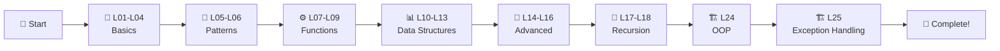

# ✅ Complete Java Step by Step - FINISHED! 🎉

<div align="center">


### 🎓 Complete Java Programming Course

**From Zero to Hero - Comprehensive Java Learning Path**

[⭐ Star this Repo](https://github.com/ranichandnirani/Complete-Java-step-by-step) • [🍴 Fork It](https://github.com/ranichandnirani/Complete-Java-step-by-step/fork) • [📝 Report Issue](https://github.com/ranichandnirani/Complete-Java-step-by-step/issues)

</div>

---

## 📌 About This Repository

This repository contains a **complete Java programming course** with hands-on code examples, covering everything from fundamentals to advanced Object-Oriented Programming concepts. Each lesson is structured with clear examples and practice problems to build strong programming foundations.

**Perfect for:**

- 🎯 Absolute beginners starting their Java journey
- 📚 Students learning Data Structures & Algorithms
- 💡 Developers mastering Object-Oriented Programming
- 🚀 Anyone preparing for coding interviews
- 📖 Quick reference for Java concepts

---

## 🎯 Course Content Overview

### 🔰 Core Fundamentals

| Lesson            | Topic                                    | Content                        | Status |
| ----------------- | ---------------------------------------- | ------------------------------ | ------ |
| **L01**           | Introduction to Java                     | Setup & First Program          |   ✅   |
| **L02**           | Input & Output                           | Scanner, I/O streams           |   ✅   |
| **L03**           | Conditional Statements                   | if-else, switch-case           |   ✅   |
| **L04**           | Loops                                    | for, while, do-while           |   ✅   |

### 🎨 Pattern Programming

| Lesson            | Topic                                    | Patterns                       | Status |
| -------           | ---------------------------------------- | ------------------------------ | ------ |
| **L05**           | Best Patterns                            | 10+ designs                    | ✅     |
| **L06**           | Advanced Patterns                        | Complex                        | ✅     |

### ⚙️ Functions & Analysis

| Lesson            | Topic                                    | Content                        | Status |
| ----------------- | ---------------------------------------- | ------------------------------ | ------ |
| **L07**           | Functions & Methods                      | Parameters, Return             | ✅     |
| **L08**           | Functions Practice                       | 10+ problems                   | ✅     |
| **L09**           | Time & Space Complexity                  | Big-O notation                 | ✅     |

### 📊 Data Structures

| Lesson            | Topic                                    | Files                          | Status |
| ----------------- | ---------------------------------------- | -----------------------------  | ------ |
| **L10**           | Arrays (1D)                              | Traversal, Operations          | ✅     |
| **L11**           | 2D Arrays                                | Matrix, Multi-dimensional      | ✅     |
| **L12**           | Strings                                  | Manipulation, Methods          | ✅     |
| **L13**           | StringBuilder                            | Efficient operations           | ✅     |

### 🔧 Advanced Concepts

| Lesson            | Topic                                 | Content                           | Status |
| ----------------- | ------------------------------------- | --------------------------------- | ------ |
| **L14**           | Operators & Binary Number System      | Bitwise operators                 | ✅     |
| **L15**           | Bit Manipulation                      | Set, Clear, Toggle, Update        | ✅     |
| **L16**           | Sorting Algorithms                    | Bubble, Selection, Insertion      | ✅     |
| **L17**           | Recursion                             | Basic recursive problems          | ✅     |
| **L18**           | Recursion 2                           | Advanced & Backtracking           | ✅     |

### 🏗️ Object-Oriented Programming

| Lesson            | Topic                             | Content                                                                 | Status |
| ----------------- | --------------------------------- | ----------------------------------------------------------------------- | ------ |
| **L24**           | OOPs                              | Classes, Objects, Inheritance, Polymorphism, Encapsulation, Abstraction | ✅     |

---

## 🚀 Quick Start

### Prerequisites

```bash
✅ Java JDK 8 or higher
✅ IDE (VS Code / IntelliJ IDEA / Eclipse)
✅ Basic programming knowledge (helpful but not required)
```

### Installation & Usage

```bash
# Clone the repository
git clone https://github.com/ranichandnirani/Complete-Java-step-by-step.git

# Navigate to the folder
cd Complete-Java-step-by-step

# Choose any lesson (example: L10 Arrays)
cd "L10 Arrays"

# Compile and run
javac filename.java
java filename
```

---

## 📂 Repository Structure

```
📦 Complete Java Step by Step
├── 📁 .vscode
│   └── VS Code settings
├── 📁 L01 intro-to-java
│   └── Introduction & Setup
├── 📁 L02 input-output
│   └── Scanner, I/O operations
├── 📁 L03 Conditional-statements
│   └── if-else, switch-case
├── 📁 L04 Loops
│   └── for, while, do-while
├── 📁 L05 Best Pattren
│   └── 10+ pattern programs
├── 📁 L06 Advance Pattrens
│   └── Complex designs
├── 📁 L07 Function & Methods
│   └── Function basics
├── 📁 L08 Functions Practice-Questions
│   └── 10+ practice problems
├── 📁 L09 Time & Space Complexity
│   └── Algorithm analysis
├── 📁 L10 Arrays
│   └── 1D array operations
├── 📁 L11 2D-Arrays
│   └── Matrix operations
├── 📁 L12 Strings
│   └── String manipulation
├── 📁 L13 String Builder
│   └── Efficient string ops
├── 📁 L14 Operators & Binary Number System
│   └── Bitwise operations
├── 📁 L15 Bit Manipulation
│   └── Advanced bit tricks
├── 📁 L16 Sorting
│   └── Sorting algorithms
├── 📁 L17 Recursion
│   └── Basic recursion
├── 📁 L18 Recursion2
│   └── Advanced recursion
└── 📁 L24 OOPs
│   └── Complete OOP concepts
├── 📁 L25 Exception Handling & Multithreading 

```
---

## 💡 Key Learning Highlights

### 🎯 What's Covered

✨ **Core Java Concepts**

- Variables, Data Types, Type Casting
- Control Flow (if-else, switch, loops)
- Input/Output operations
- Arrays (1D & 2D)
- String manipulation & StringBuilder

🔥 **Advanced Topics**

- Time & Space Complexity Analysis
- Bit Manipulation Techniques
- Sorting Algorithms (Bubble, Selection, Insertion)
- Recursion & Backtracking
- Binary Number System

🏆 **Object-Oriented Programming**

- Classes & Objects
- Inheritance (Single, Multilevel, Hierarchical)
- Polymorphism (Method Overloading & Overriding)
- Encapsulation & Access Modifiers
- Abstraction (Abstract Classes & Interfaces)
- Static & Final Keywords

🚀 **Practical Skills**

- 20+ Pattern Programming Problems
- 10+ Function Practice Questions
- Real-world coding examples
- Algorithm implementation
- Problem-solving techniques

---

## 🎓 Learning Path



---

## 📖 Detailed Topics

<details>
<summary>🔰 <b>L01: Introduction to Java</b></summary>

- What is Java?
- JDK, JRE, JVM
- Setting up environment
- First Java program
- Basic syntax
</details>

<details>
<summary>📥 <b>L02: Input & Output</b></summary>

- Scanner class
- BufferedReader
- Console I/O
- Reading different data types
- Input validation
</details>

<details>
<summary>🔀 <b>L03: Conditional Statements</b></summary>

- if statement
- if-else statement
- Nested if-else
- else-if ladder
- switch-case statement
- Ternary operator
</details>

<details>
<summary>🔁<b>L04: Loops</b></summary>

- for loop
- while loop
- do-while loop
- Nested loops
- break & continue
- Loop patterns
</details>

<details>
<summary>🎨 <b>L05-L06: Pattern Programming</b></summary>

- Square patterns
- Triangle patterns
- Diamond patterns
- Number patterns
- Character patterns
- Hollow patterns
- Pyramid patterns
- Advanced designs
</details>

<details>
<summary>⚙️ <b>L07-L08: Functions & Methods</b></summary>

- Method declaration
- Parameters & arguments
- Return types
- Method overloading
- Scope & lifetime
- Recursion basics
- Practice problems
</details>

<details>
<summary>📊 <b>L09: Time & Space Complexity</b></summary>

- Big-O notation
- Time complexity analysis
- Space complexity analysis
- Best, Average, Worst case
- Common complexity classes
</details>

<details>
<summary>📋 <b>L10-L11: Arrays</b></summary>

- Array declaration
- Array initialization
- Traversing arrays
- Searching algorithms
- 2D arrays
- Matrix operations
- Common array problems
</details>

<details>
<summary>📝 <b>L12-L13: Strings</b></summary>

- String creation
- String methods
- String comparison
- String manipulation
- StringBuilder class
- StringBuffer class
- String problems
</details>

<details>
<summary>🔧 <b>L14-L15: Bit Manipulation</b></summary>

- Binary number system
- Bitwise operators
- Set bit
- Clear bit
- Toggle bit
- Update bit
- Bit masking
- Advanced tricks
</details>

<details>
<summary>🔄 <b>L16: Sorting</b></summary>

- Bubble sort
- Selection sort
- Insertion sort
- Time complexity
- Space complexity
- Comparison
</details>

<details>
<summary>🔁 <b>L17-L18: Recursion</b></summary>

- Recursion basics
- Base case & recursive case
- Call stack
- Tail recursion
- Backtracking
- Advanced problems
- Optimization techniques
</details>

<details>
<summary>🏗️ <b>L24: Object-Oriented Programming</b></summary>

- Classes & Objects
- Constructors
- this keyword
- Inheritance
- super keyword
- Polymorphism
- Method overriding
- Encapsulation
- Access modifiers
- Abstraction
- Abstract classes
- Interfaces
- Static keyword
- Final keyword
</details>

<details>
<summary> 📖 <b>L25: Exception Handling & Multithreading</b></summary>

- Try
- Catch
- Finally
- Throw
- Throws
- Thread
</details>

---

## 🤝 Contributing

Contributions are welcome! Here's how you can help:

1. 🍴 Fork the repository
2. 🌿 Create a feature branch (`git checkout -b feature/AmazingFeature`)
3. ✍️ Commit your changes (`git commit -m 'Add some feature'`)
4. 📤 Push to the branch (`git push origin feature/AmazingFeature`)
5. 🔃 Open a Pull Request

**Contribution Ideas:**

- 🐛 Fix bugs or typos
- ✨ Add more practice problems
- 📝 Improve documentation
- 💡 Share alternative solutions
- 🎯 Add comments and explanations

---

## 📚 Useful Resources

### Official Documentation

- [☕ Oracle Java Docs](https://docs.oracle.com/javase/tutorial/)
- [📖 Java SE API](https://docs.oracle.com/en/java/javase/17/docs/api/)
- [🔧 OpenJDK](https://openjdk.org/)

### Learning Platforms

- [💻 GeeksforGeeks Java](https://www.geeksforgeeks.org/java/)
- [📚 W3Schools Java](https://www.w3schools.com/java/)
- [🎥 Java Tutorial Point](https://www.tutorialspoint.com/java/)
- [📖 JavaTpoint](https://www.javatpoint.com/java-tutorial)

### Practice Coding

- [🎯 LeetCode](https://leetcode.com/)
- [💪 HackerRank Java](https://www.hackerrank.com/domains/java)
- [🏆 CodeChef](https://www.codechef.com/)
- [⚔️ Codeforces](https://codeforces.com/)
- [🎓 HackerEarth](https://www.hackerearth.com/)

### Video Tutorials

- [🎥 Apna College](https://www.youtube.com/@ApnaCollegeOfficial)
- [🎬 Kunal Kushwaha](https://www.youtube.com/@KunalKushwaha)
- [📺 Code With Harry](https://www.youtube.com/@CodeWithHarry)

---

## 🌟 Features

- ✅ **20 Structured Lessons**: From basics to advanced OOP
- ✅ **Hands-on Code**: Every concept with working examples
- ✅ **Pattern Mastery**: 15+ creative pattern programs
- ✅ **Algorithm Focus**: Sorting, recursion, and complexity analysis
- ✅ **Clean & Commented**: Easy-to-understand code structure
- ✅ **Progressive Learning**: Difficulty increases gradually
- ✅ **Interview Ready**: Covers common coding interview topics
- ✅ **Practice Problems**: 35+ challenges to solve

---

## 📊 Course Statistics

```
📚 Total Lessons: 20
💻 Total Topics Covered: 50+
🎯 Practice Problems: 35+
🎨 Pattern Programs: 15+
⏱️ Estimated Time: 60-80 hours
🎓 Difficulty: Beginner to Advanced
📝 Languages: 100% Java
```

---

## 🎯 Learning Outcomes

After completing this course, you will be able to:

✅ Write clean, efficient Java code  
✅ Understand core programming concepts  
✅ Implement data structures and algorithms  
✅ Master Object-Oriented Programming  
✅ Solve coding problems independently  
✅ Analyze time and space complexity  
✅ Build Java applications from scratch  
✅ Prepare for technical interviews  

---

## 🌟 Show Your Support

If this repository helped you learn Java:

⭐ **Star** this repository  
🍴 **Fork** for your reference  
📢 **Share** with fellow learners  
🤝 **Contribute** to improve it  

---

## 🔗 Connect With Me

<div align="center">

[](https://github.com/ranichandnirani)
[](https://www.linkedin.com/in/chandni-rani)
[](https://www.instagram.com/the_chan_dni/)


</div>

---

## 💬 Support

Need help or have questions?

- 💡 [Open an Issue](https://github.com/ranichandnirani/Complete-Java-step-by-step/issues)
- 📧 Email: chandnirani229@gmail.com
- 🌐 GitHub: [@ranichandnirani](https://github.com/ranichandnirani)

---

<div align="center">

### 🎉 Course Completed Successfully! 🎉

**Made with ❤️ and ☕ by Cha**

_Happy Coding! Keep Learning, Keep Growing!_ 💻✨

---


**⭐ If this helped you, please star this repository! ⭐**


</div>